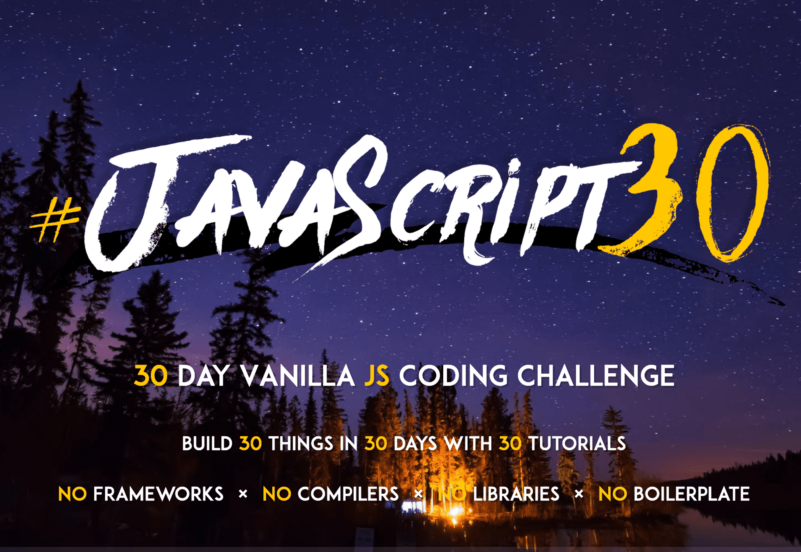

# TIL

✨ Today I Learned...

 

## Git

- [x] [What is Git?](https://github.com/cona-tus/TIL/blob/master/git-github/1.git.md 'Git이란?')
- [x] [Git Commands](https://github.com/cona-tus/TIL/blob/master/git-github/2.git-commands.md 'Git 명령어')
- [x] [Git Branch](https://github.com/cona-tus/TIL/blob/master/git-github/3.git-branch.md 'Git Branch')
- [x] [Git Undoing](https://github.com/cona-tus/TIL/blob/master/git-github/4.git-undoing.md 'Git 되돌리기')
- [x] [How to use Github](https://github.com/cona-tus/TIL/blob/master/git-github/5.github.md 'Github 사용하기')
- [x] [Conventional Commits](https://github.com/cona-tus/TIL/blob/master/git-github/6.conventional-commit.md 'Commit Message')
- [x] [Git Flow](https://github.com/cona-tus/TIL/blob/master/git-github/7.git-flow.md 'Git flow')

 

---

## JavaScript

- [x] [Variable](https://github.com/cona-tus/TIL/tree/master/javascript/01.variable '변수')
- [x] [Operator](https://github.com/cona-tus/TIL/tree/master/javascript/02.operator '연산자')
- [x] [Control](https://github.com/cona-tus/TIL/tree/master/javascript/03.control '조건문')
- [x] [Object](https://github.com/cona-tus/TIL/tree/master/javascript/04.object '객체')
- [x] [Function](https://github.com/cona-tus/TIL/tree/master/javascript/05.function '함수')
- [x] [Class](https://github.com/cona-tus/TIL/tree/master/javascript/06.class '클래스')
- [x] [Built-in Objects](https://github.com/cona-tus/TIL/tree/master/javascript/07.built-in '빌트인 객체')
- [x] [Array](https://github.com/cona-tus/TIL/tree/master/javascript/08.array '배열')
- [x] [Iterator](https://github.com/cona-tus/TIL/tree/master/javascript/09.iterator '이터레이터')
- [x] [Set & Map](https://github.com/cona-tus/TIL/tree/master/javascript/10.set-map 'Set & Map')
- [x] [Prototype](https://github.com/cona-tus/TIL/tree/master/javascript/11.prototype '프로토타입')
- [x] [Scope](https://github.com/cona-tus/TIL/tree/master/javascript/12.scope '스코프')
- [x] [Closure](https://github.com/cona-tus/TIL/tree/master/javascript/13.closure '클로저')
- [x] [Asynchronous](https://github.com/cona-tus/TIL/tree/master/javascript/14.asynchronous '비동기')
- [x] [This](https://github.com/cona-tus/TIL/tree/master/javascript/15.this 'This')
- [x] [Error](https://github.com/cona-tus/TIL/tree/master/javascript/16.error '에러')
- [x] [Module](https://github.com/cona-tus/TIL/tree/master/javascript/17.module '모듈')

 

### Javascript Practice

  
Chrome Clone

  

  
30 Day Challenge

  

  
WeWay | Seoul Metro Elevator Application

  

 

---

 

## etc...

- [x] [Markdown](https://github.com/cona-tus/TIL/blob/master/markdown.md '마크다운')
- [x] [Shell Commands](https://github.com/cona-tus/TIL/blob/master/shell-commands.md 'Shell 명령어')
