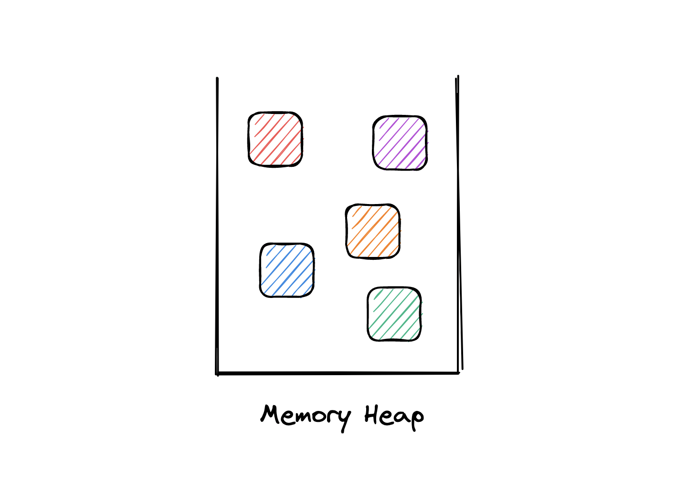
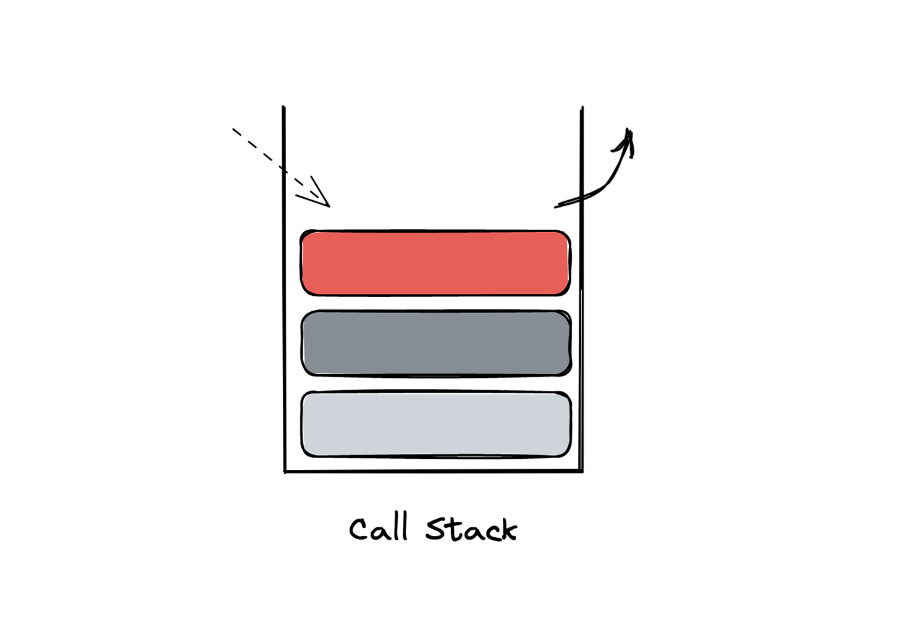
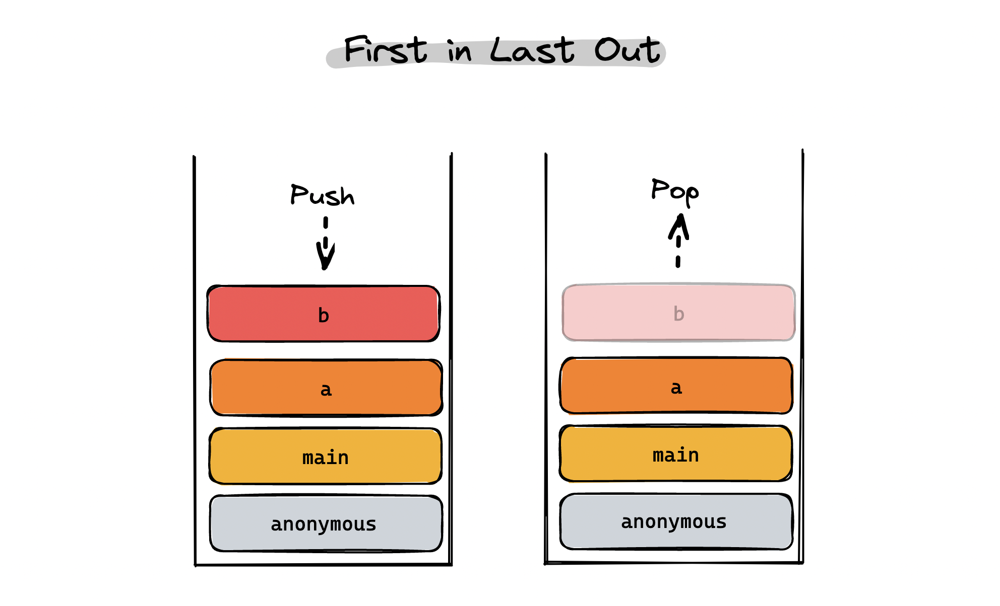
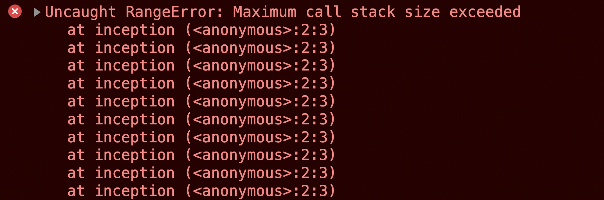

# Inside the JavaScript Engine

> 자바스크립트 엔진은 코드를 **읽고** 그것을 **실행**하는 일을 한다. 이 단계에서 데이터를 저장하고, 실행 중인 작업 하나 하나를 추적할 공간이 필요해진다. 여기서 등장하는 중요한 두 가지 개념이 메모리 힙과 콜스택이다.

<br/>

## Memory Heap


메모리 힙은 할당된 데이터가 저장되는 영역으로, 장기 메모리와 관련이 있다.  
산재된 데이터들을 보관하는 저장소라고 생각해보자.

<br/>

## Stack


스택은 단기 메모리 영역으로, 자바스크립트 엔진이 수행하는 작업 내역을 기록하는 역할을 한다.
항목을 순서대로 차곡차곡 쌓아서 관리하기 때문에 함수들간의 관련성이나 실행 순서를 파악하는데 도움이 된다.

<br/>



스크립트가 실행될 때, 말하자면 함수가 실행될 때마다 콜스택을 사용한다.  
새로운 함수 호출이나 단기 데이터를 `push`해서 배치하고, 작업이 끝나면 해당 항목을 `pop`하여 제거한다.  
이 스크립트의 흐름을 선입선출(FILO, First in Last Out) 방식이라고 한다.  
마지막 작업이 먼저 방출된다는 뜻이다.

<br/>

## Stack Overflow

만약 서로 중첩된 함수를 계속해서 호출하면 어떻게 될까?

```js
function inception() {
  inception();
}

inception();
```



이렇게 재귀함수(Recursion)를 호출하는 경우에는 프로세스에 지정된 최대치의 콜스택 사이즈를 초과하는 에러가 발생한다. 이 경우를 스택 오버플로(Stack Overflow)라고 한다.

<br/>
<br/>
