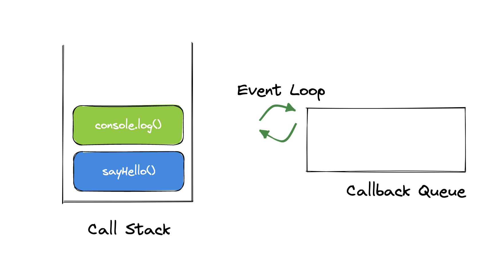

# Javascript RunTime

> 자바스크립트는 <u>싱글 스레딩 프로그래밍 언어이다. 그 말인 즉슨, 한 번에 하나의 일만 처리한다는 의미이다.</u> 동기적 방식에서는 시간이 걸리는 작업을 수행할 때 사용자가 웹 사이트에 접근하지 못하는 등 사용자 경험에 나쁜 영향을 줄 수 있다.

<br/>

## Web APIs

하지만 다행히도, Web API로 멀티스레딩이 가능하다.  
Web API는 자바스크립트 런타임 환경을 가지고 있는 브라우저에서 제공된다.

Web API가 fetch, event listener, DOM API, setTimeout 등의 작업을 수행하는 동안 자바스크립트 엔진은 콜스택 작업을 계속할 수 있게 되고, 이로써 다양한 작업을 동시에, 비동기적으로 처리하게 되는 것이다.

다음의 코드를 보자.

```js
function sayHello() {
  console.log('Hello World!');
}

function b() {
  setTimeout(sayHello, 3000);
}

function a() {
  b();
}

function main() {
  a();
}

main();
```

main() => a() => b() 차례대로 콜스택에 쌓이고, b() => a() => main() 순으로 마지막 항목부터 제거된다.  
그렇다면 setTimeout()의 경우엔 어떨까.

<br/>


setTimeout()처럼 콜스택에 자바스크립트 엔진이 처리하지 않는 Web API 항목이 들어오면, 콜스택은 이를 Web API로 전달하여 백그라운에서 작업이 수행될 수 있도록 한다.

<br/>

## Event Loop and Callback Queue


콜백 큐. 큐(Queue)는 자료구조 중 하나로, <u>FIFO(first-in first-out)</u> 방식을 사용한다.
처음 add된 항목이 가장 먼저 remove된다는 뜻이다.

<br/>


**콜백 큐는 콜스택이 완전히 비워지기 전까지, 즉 코드블럭이 끝나기 전까지 실행할 수 없다.**
따라서 **이벤트 루프**는 프로세스가 동작하는 동안 콜스택이 비어있는지 지속적으로 확인한다.

<br/>


만약 콜스택이 비어있다면, 콜백 큐에 있는 항목을 콜스택에 추가하여 자바스크립트 엔진이 이를 처리할 수 있도록 돕는다.

따라서 위 코드의 실행 순서는 다음과 같다.  
b() => a() => main()이 제거된 후 sayHello()가 콜백 큐를 거쳐 스택에 추가되고, console.log('Hello World!')가 실행된다.

<br/>
<br/>

[참고 사이트](http://latentflip.com/loupe/?code=ZnVuY3Rpb24gcHJpbnRIZWxsbygpIHsNCiAgICBjb25zb2xlLmxvZygnSGVsbG8gZnJvbSBiYXonKTsNCn0NCg0KZnVuY3Rpb24gYmF6KCkgew0KICAgIHNldFRpbWVvdXQocHJpbnRIZWxsbywgMzAwMCk7DQp9DQoNCmZ1bmN0aW9uIGJhcigpIHsNCiAgICBiYXooKTsNCn0NCg0KZnVuY3Rpb24gZm9vKCkgew0KICAgIGJhcigpOw0KfQ0KDQpmb28oKTs%3D!!!PGJ1dHRvbj5DbGljayBtZSE8L2J1dHRvbj4%3D) 에서 작동 방식을 시뮬레이션해 볼 수 있다.

<br/>
<br/>
