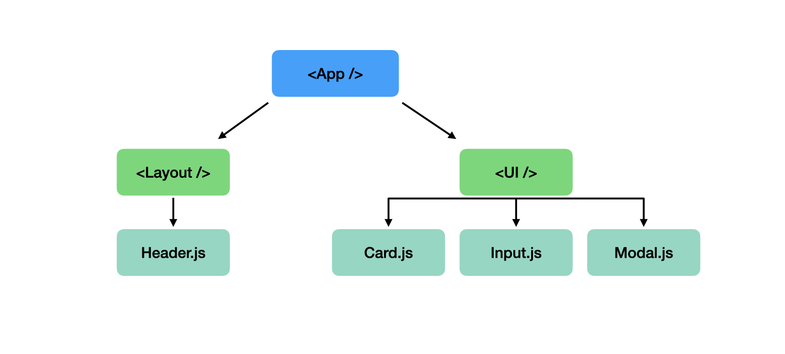

# 🔵 Components


## 🔹 "React is all about `Components`"

> 모든 사용자 인터페이스들은 결국 컴포넌트로 구성되기 때문이다.

<br/>

## 🔹 What Components are

> 컴포넌트란 사용자 인터페이스에서 재사용할 수 있는 빌딩 블럭이다.

컴포넌트란, 한 가지의 기능을 수행하는 UI 단위를 말한다. 컴포넌트는 서로 독립적이고 응집적(state & render)이며 재사용이 가능하다.

<br/>

## 🔹 Why Components?

1. 재사용성(Reusability): 반복되는 코드를 피할 수 있다.
2. 유지보수성(Separation of Concerns): 코드베이스를 작고 관리 가능한 단위로 유지할 수 있다.

<br/>

## 🔹 How is a Component Built?

리액트는 HTML과 자바스크립트(+CSS)로 구성된 재사용이 가능하고 반응성이 뛰어난 컴포넌트를 만들 수 있게 도와준다. 리액트는 이러한 컴포넌트를 만들기 위해서 `선언적 접근 방식(Declarative Approach)`을 사용한다.

```js
// 명령적 접근 방식
function App() {
  const p = document.createElement('p');
  p.textContent = 'This is also visible';
  document.getElementById('root').append(p);
}

// 선언적 접근 방식
function App() {
  return (
    <div>
      <p>This is also visible!</p>
    </div>
  );
}
```

리액트로 작업할 때는 자바스크립트에서처럼 구체적인 DOM을 업데이트하는 지침을 단계적으로 작성할 필요가 없다. 그저 최종 상태와 어떤 상황에서 어떤 상태가 되어야 하는지를 정의하면 된다.

<br/>

## 🔹 Build A Component Tree

컴포넌트도 DOM(Document Object Model)과 마찬가지로 트리 형식으로 만들어져 있다.



맨 위에 가장 중요한 App 컴포넌트가 있고, 그 아래에 사용자 지정 HTML 요소를 가질 수 있다. 맨 위 컴포넌트가 리액트 DOM render의 지시로 HTML 페이지에 직접 렌더링된다.
